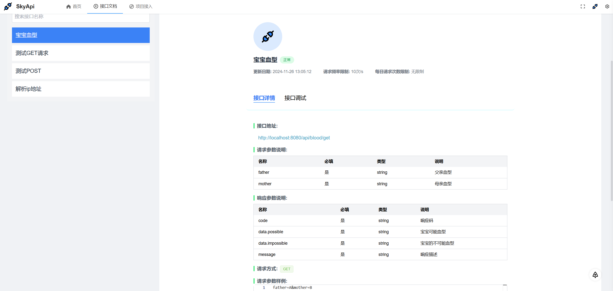
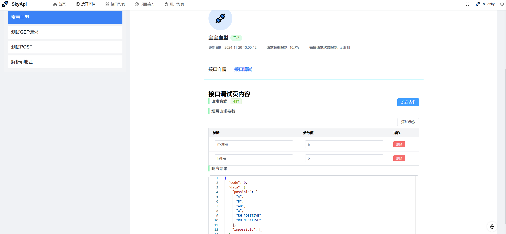
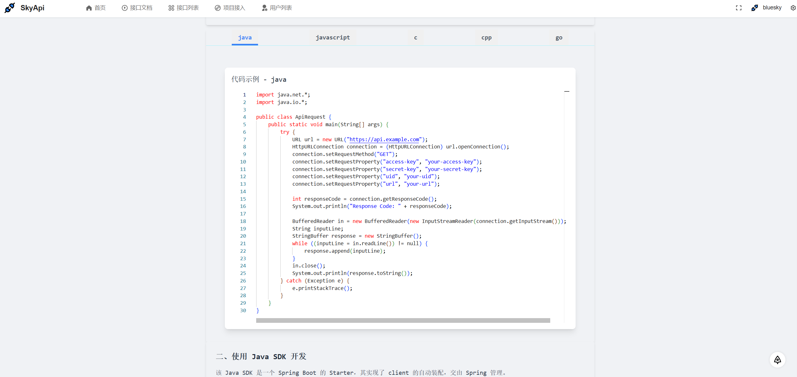
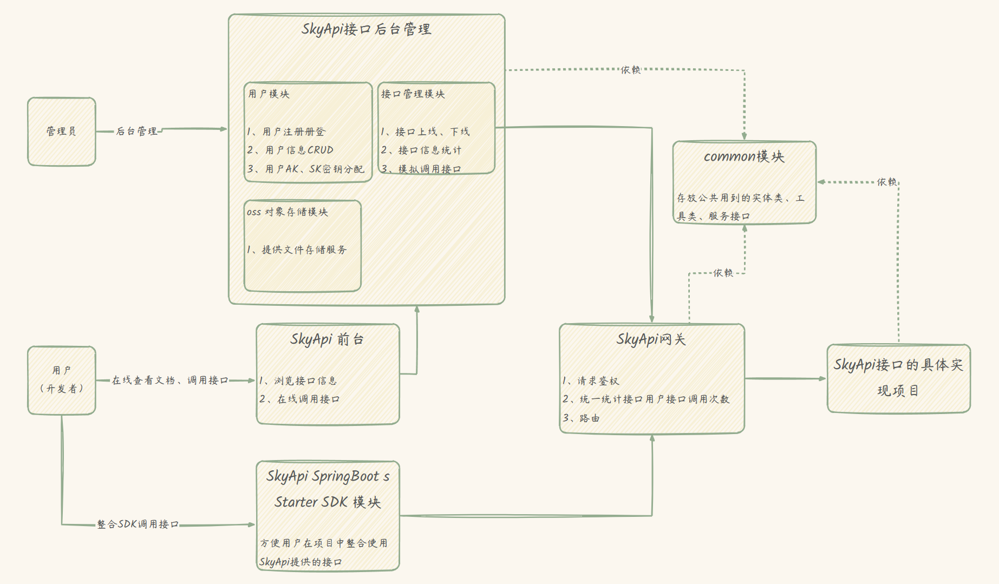

## 项目介绍
skyApi 一个在线接口调用平台。助力你的项目飞速启动。用API让世界更简单!

🌱[体验一下](http://skyapi.redmeat.site:10507/)

1、接口浏览

2、接口文档

3、在线调用

4、接入项目

### 系统&设计

### 后端技术选型
- ⭐️ Java Spring Boot 框架
- ⭐️ MySQL数据库 + Mybatis-Plus框架
- ⭐️ Spring Gateway 网关
- ⭐️ Redis 分布式缓存
- ⭐️ Nacos 注册中心
- ⭐️ Dubbo RPC框架 
